# Fruit Shopping E-commerce Website


---

# Overview

The **Fruit Shopping Website** is a full-stack e-commerce web application designed to provide an online platform for purchasing fresh fruit products.

The system supports the **entire shopping lifecycle**, from user registration to order delivery tracking. Customers can browse fruit products, add them to a shopping cart, apply vouchers, complete checkout, and monitor order progress.

The project was developed as part of an academic software engineering course and focuses on implementing a **traditional Java web architecture using Java Servlet and JSP following the MVC design pattern**.

The application emphasizes:

- Clean **MVC architecture**
- Session and cookie management
- Secure authentication mechanisms
- Voucher and discount system
- Order management workflow
- Admin dashboard for system control

---

# Project Information

| Category | Details |
|--------|--------|
Project Name | Fruit Shopping E-commerce Website |
Duration | Feb 2024 – Jun 2024 |
Team Size | 2 Members |
Role | Project Lead, Full-Stack Developer, Database Designer |
Final Grade | **9.5 / 10** |

---

# Key Features

## Customer Features

The platform provides a complete online shopping workflow:

- User registration and login
- Google social login
- Facebook social login
- Password recovery via email
- Browse fruit products
- Product search and filtering
- Shopping cart management
- Checkout and order placement
- Voucher and discount system
- Product review and rating
- Order tracking

---

# Authentication System

The system supports **multiple authentication methods**.

### Traditional Login

Users can register and log in using:

- Email
- Password

User credentials are stored securely in the database.

---

### Google Login

Users can authenticate using their **Google account** through OAuth authentication.

Benefits:

- Faster login experience
- Secure authentication
- No password storage required

---

### Facebook Login

The system also integrates **Facebook OAuth authentication** allowing users to sign in using their Facebook accounts.

---

### Password Recovery

If users forget their password, they can:

1. Request password reset
2. Receive reset link via email
3. Set a new password

---

# Shopping Cart System

The shopping cart is implemented using **cookies** to maintain user session data.

Features include:

- Add product to cart
- Update product quantity
- Remove product from cart
- Persist cart across page refresh
- Calculate total price dynamically

Cart information is stored in the user's browser to maintain session continuity.

---

# Checkout Workflow

The checkout process includes multiple steps:

1. Validate cart contents
2. Input shipping information
3. Apply voucher code
4. Select payment method
5. Confirm order

After checkout, the system creates an order and stores it in the database.

---

# Payment Methods

The system supports two payment methods.

### Cash On Delivery (COD)

Customers pay when the order arrives at their address.

---

### QR Payment

Users can scan a **QR code** to complete payment through mobile banking applications.

---

# Voucher System

The platform includes a flexible voucher system to support promotional campaigns.

Voucher features include:

- Percentage discount
- Fixed amount discount
- Minimum order value condition
- Expiration date validation
- Voucher usage limitations

Voucher validation occurs during the checkout process.

---

# Product Review System

Customers can leave feedback on purchased products.

Features include:

- Star rating system
- Written product reviews
- Review display on product pages

Reviews help improve product credibility and customer trust.

---

# Order Tracking System

Users can track the progress of their orders through different statuses.

Typical order statuses include:

- Pending Confirmation
- Confirmed
- Preparing Order
- Shipping
- Delivered
- Cancelled

Customers can view their order history and detailed order information.

---

# Admin Dashboard

The system provides a management interface for administrators.

Admin capabilities include:

- Manage user accounts
- Manage product catalog
- Manage orders
- Manage vouchers
- Manage reviews
- Control user permissions

The admin dashboard helps maintain store operations efficiently.

---

# System Architecture

The application follows the **MVC (Model – View – Controller) architecture**.

```

Client (Browser)
↓
JSP View Layer
↓
Servlet Controllers
↓
Business Logic / Services
↓
DAO Layer
↓
MySQL Database

```

### Model

Represents system data such as:

- Users
- Products
- Orders
- Vouchers
- Reviews

---

### View

The **JSP pages** are responsible for rendering UI components.

Examples:

- home.jsp
- login.jsp
- register.jsp
- cart.jsp
- checkout.jsp
- admin dashboard pages

---

### Controller

Servlet classes process incoming HTTP requests and connect the view with the data layer.

Examples:

- LoginServlet
- RegisterServlet
- ProductServlet
- CartServlet
- CheckoutServlet
- AdminServlet

---

# Technology Stack

## Backend

- Java
- Java Servlet
- JSP
- JDBC
- MVC Architecture

---

## Frontend

- HTML
- CSS
- JavaScript
- Bootstrap

---

## Database

- MySQL

---

## Authentication Integration

- Google OAuth Login
- Facebook OAuth Login

---

# Project Structure

```

ThucTapWeb
│
├── .github
│   └── workflows
│
├── .idea
│
├── screenshots
│   ├── skin-home.png
│   ├── skin-shop.png
│   ├── skin-cart.png
│   ├── skin-checkout.png
│   ├── skin-orders.png
│   ├── skin-login.png
│   ├── skin-register.png
│   ├── skin-admin-dashboard.png
│   ├── skin-admin-product.png
│   ├── skin-admin-order.png
│   ├── skin-admin-user.png
│   ├── skin-admin-review.png
│   └── skin-admin-voucher.png
│
├── src
│   └── main
│       │
│       ├── java
│       │   ├── controller        # Servlet controllers (handle requests)
│       │   ├── dao               # Database access layer
│       │   ├── model             # Entity / data models
│       │   └── utils             # Utility classes (DB connection, helpers)
│       │
│       └── webapp
│           │
│           ├── WEB-INF
│           │   ├── admin         # Admin JSP pages
│           │   ├── client        # Customer JSP pages
│           │   └── web.xml       # Servlet configuration
│           │
│           ├── assets            # CSS, JS, libraries
│           ├── assetsAD          # Admin assets
│           ├── images            # Static images
│           │
│           └── index.jsp         # Entry page
│
├── .gitignore
├── Dockerfile                    # Docker deployment configuration
├── fly.toml                      # Fly.io deployment configuration
├── package.json                  # Frontend dependencies
├── package-lock.json
├── pom.xml                       # Maven dependencies
│
└── README.md

````

---

# Installation Guide

## 1. Clone Repository

```bash
git clone https://github.com/ThanhTan67/ThucTapWeb.git
````

---

# System Requirements

Before running the project, ensure the following tools are installed:

* **Java JDK 8 or higher**
* **Apache Tomcat 9+**
* **MySQL Server**
* **Maven (optional)**
* **IDE such as IntelliJ IDEA or Eclipse**

---

# Database Setup

Open MySQL and create a database:

```sql
CREATE DATABASE fruits;
```

Import the provided SQL schema:

```sql
SOURCE database/fruits.sql;
```

---

# Configure Database Connection

Edit the database connection file.

Example: `DBConnection.java`

```java
String url = "jdbc:mysql://localhost:3306/fruits";
String username = "root";
String password = "yourpassword";
```

---

# Environment Configuration

Some integrations require configuration variables.

Create a `.env` file in the project root:

```
DB_HOST=localhost
DB_PORT=3306
DB_NAME=fruits
DB_USERNAME=root
DB_PASSWORD=yourpassword

GOOGLE_CLIENT_ID=your_google_client_id
GOOGLE_CLIENT_SECRET=your_google_secret

FACEBOOK_APP_ID=your_facebook_app_id
FACEBOOK_APP_SECRET=your_facebook_secret

EMAIL_HOST=smtp.gmail.com
EMAIL_PORT=587
EMAIL_USER=your_email@gmail.com
EMAIL_PASSWORD=your_email_password
```

---

# Run the Project

## Deploy to Apache Tomcat

Build the project as a **WAR file** and deploy to Tomcat.

Steps:

1. Package the project
2. Copy the `.war` file to Tomcat `webapps` folder

Example:

```
apache-tomcat/webapps/fruitshop.war
```

Start Tomcat server.

---

## Access Application

Open browser:

```
http://localhost:8080/fruitshop
```

---

# API Overview

Example servlet endpoints:

```
/login
/register
/products
/cart
/checkout
/orders
/admin
```

---

# Interface

## Customer Pages

<p align="center">
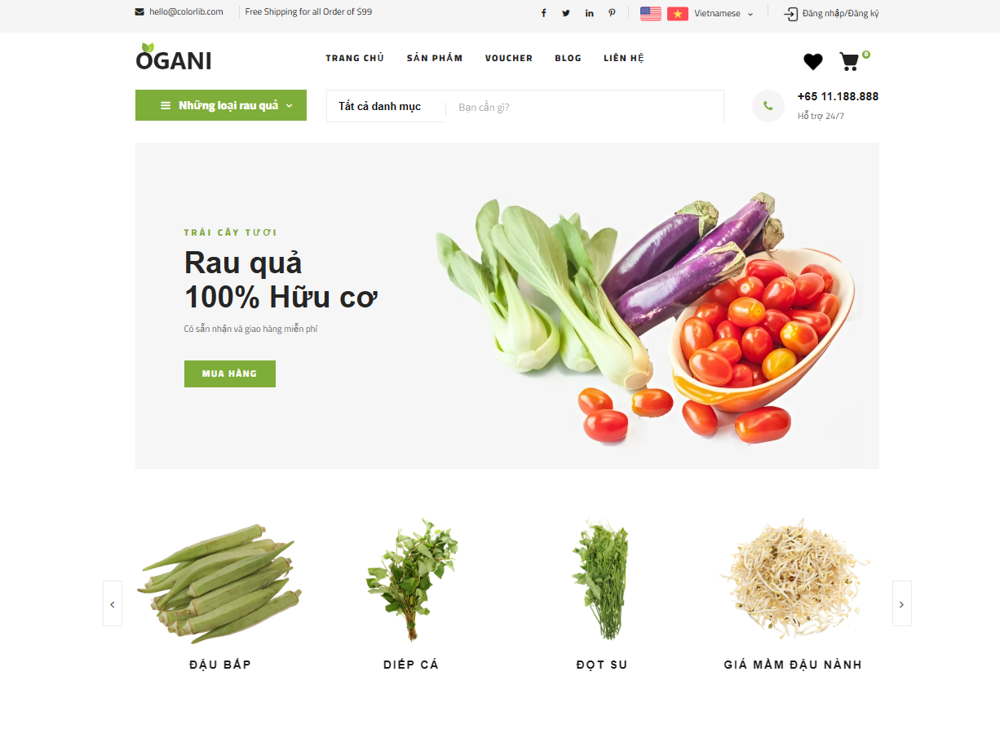
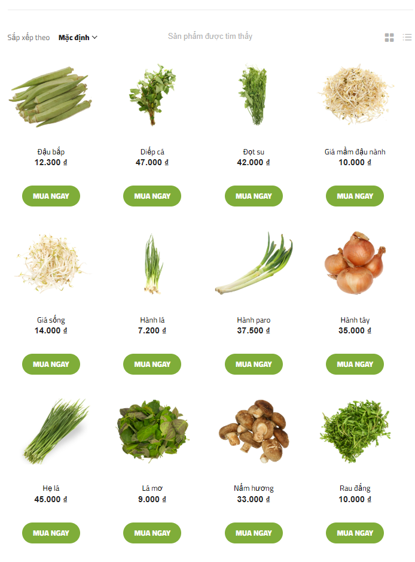
</p>

<p align="center">
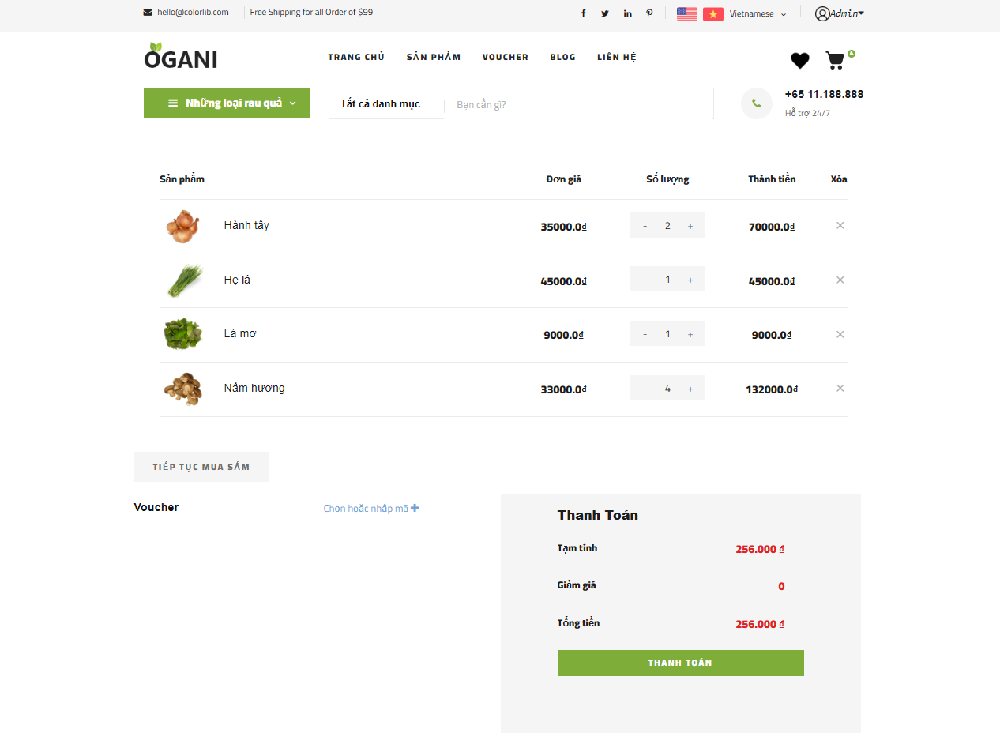
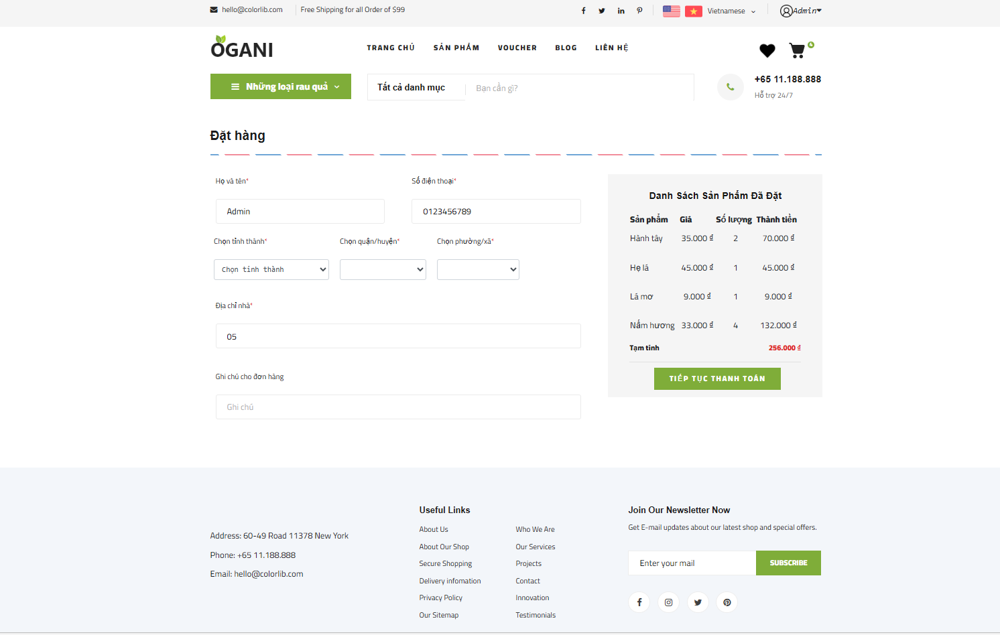
</p>

<p align="center">
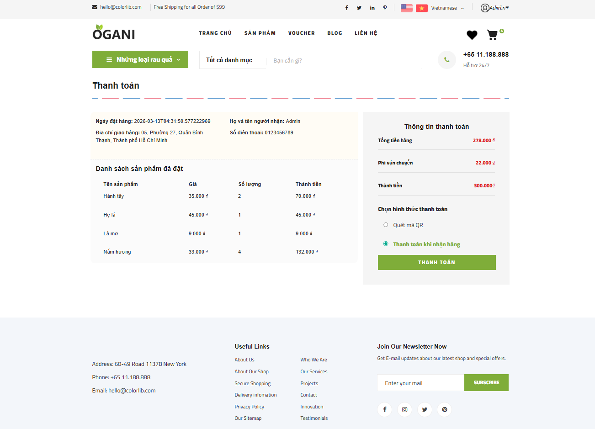

</p>

<p align="center">
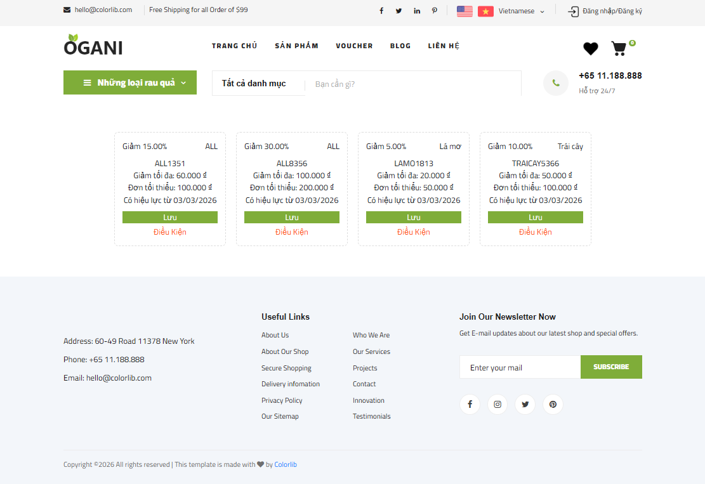
</p>

---

## Authentication

<p align="center">
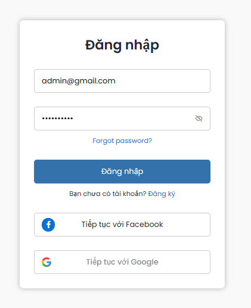
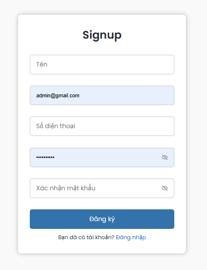
</p>

---

## Admin Dashboard

<p align="center">
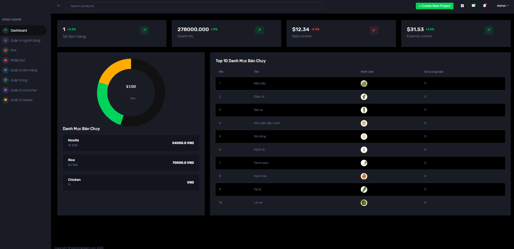
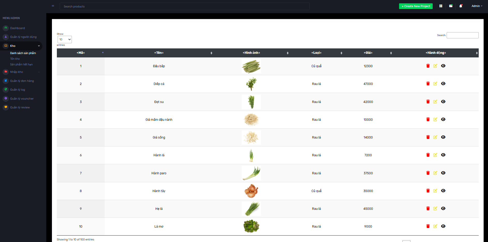
</p>

<p align="center">
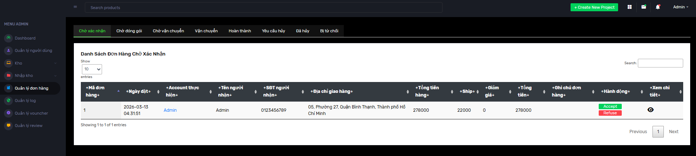
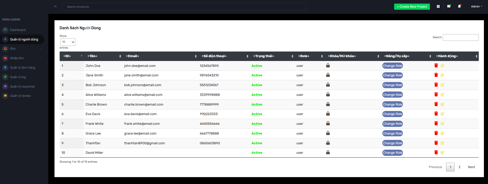
</p>

<p align="center">
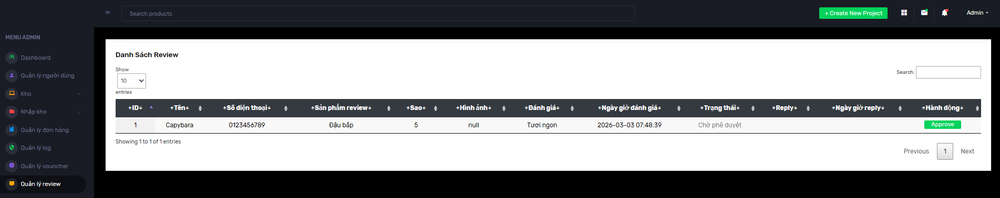
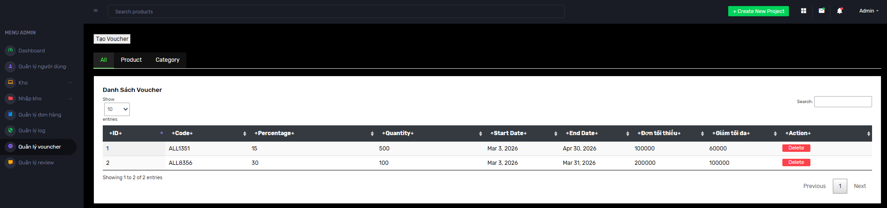
</p>

<p align="center">
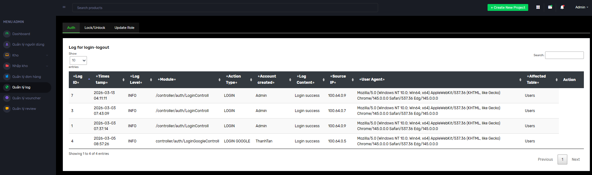
</p>

---
# Learning Outcomes

Through this project, several important skills were developed:

* Building full-stack Java web applications
* Applying MVC architecture in real systems
* Implementing authentication with OAuth
* Managing session and cookies
* Designing relational databases
* Developing admin management systems

---

# Author

**Cao Thanh Tan**

Role: Project Lead / Full-Stack Developer / Database Designer

---

# License

This project is developed for educational purposes.
